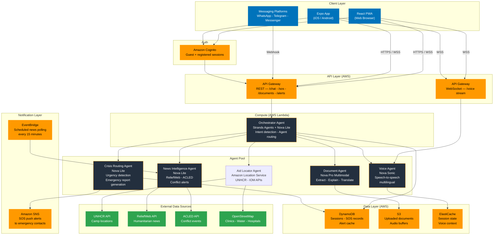

## **1. Diagram**

## **2. Costs**
**Total Hackathon Cost: ~$14**

|AWS Service|Hackathon Cost|Why|
|---|---|---|
|**Amazon Nova Sonic**|~$3.00|~60 min of demo voice sessions @ $0.017/min blended|
|**Amazon Nova Lite**|~$1.50|Orchestrator + chat tokens (~2M tokens @ $0.06/1M in + $0.24/1M out)|
|**Amazon Nova Pro**|~$0.50|~50 document uploads for testing|
|**API Gateway (WebSocket)**|~$1.00|Voice streaming sessions|
|**Amazon Location Service**|~$0.25|~500 aid center proximity queries|
|**Amazon SNS**|~$0.08|~100 SOS test alerts|
|**Amazon S3**|~$0.02|Document uploads (<1GB)|
|**Contingency buffer**|~$1.00|10%|
|**Lambda, DynamoDB, Cognito, CloudWatch, API Gateway REST**|$0.00|All covered by AWS free tier|
|**UNHCR, ReliefWeb, ACLED, OpenStreetMap APIs**|$0.00|Free for humanitarian use|

**The big takeaway:** Nova Sonic is probably only real spend at ~$3, and that's for 60 minutes of voice testing. If we keep demo voice sessions short (under 5 min each), we could run the entire hackathon for under $10. The free tier absorbs almost everything else.
